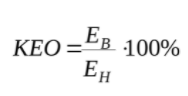

# Фундамент

## Проблема

### Проблема по-простому (не войдет в финальную версию)

Есть норматив для зданий по освещенности помещений. Если помещения недостаточно освещены, то в них будет сложно жить/работать/рожать/учиться/воспитывать детей/делать выставки и так далее (НАДО ПОДТВЕРДИТЬ ССЫЛКАМИ НА ИСТОЧНИКИ, ДЛЯ КАЖДОГО ТЕЗИСА ОТДЕЛЬНО). Так же освещенность влияет на психику человека. Если проводить много времени в теменоте, то может поехать крыша.

Такой расчет называется КЕО (коэффициент естественной освещенности). С ним связаны ряд документов - СП 52.13330.2016, СП 367.1325800.2017, СП 23-102-2003, СанПиН 2.2.1/2.1.1.1278-03 и возможно еще какие-то.

Этим расчетом должны заниматься архитекторы. Отсюда начинаются проблемы. Не все архитекторы умеют считать КЕО. Здесь 3 варианта решения проблемы: научить, отдать на подряд, считать в программе. Если архитектор умеет считать, то на расчет нужно потратить время и силы. Если по расчету не хватает освещенности, то нужно поменять форму здания или планировки или окна и считать заново. Архитектор может посчитать с ошибками, тогда после подсчета проект проходит проверку в экспертизе и проваливает ее. На прохождение экспертизы нужно потратить время и деньги. Если отдать расчет на подряд, то здесь будут все стандартные проблемы связанные с подрядом. Последний вариант - расчет в специальной программе. Програм для расчета КЕО не так много, у каждой свои проблемы.

### Описание КЕО

В Российской Федерации проект, по которому будут строить новое здание, должен проходить по критериям, указанным в ряде нормативных документов (ГОСТы, СанПиНы, СП, СНиПы). Одна из целей этих нормативов - поддержание здоровой жизни людей, которые будут жить в новом здании.

Нормативные документы делятся на несколько областей. Одна из таких областей - освещение. В области освещения есть два основных критерия, по которым здание может пр ти нормативы - инсоляция и кео.

КЕО - Коэффициент естественной освещенности. КЕО важен для сохранения качества зрения и поддержания психологического благополучия.

Выделяют три вида освещения — искусственное, естественное и совмещенное (естественное и искусственное вместе). Естественное освещение обеспечивается солнечным излучением.

Для оценки интенсивности освещения используют понятие освещенности (Е), измеряемой в люксах (лк). Для измерения освещенности применяют прибор под названием люксметр.

Согласно СП 52.13330.2016 «Естественное и искусственное освещение» , естественное освещение — освещение помещений светом неба (прямым или отраженным), проникающим через световые проемы в наружных ограждающих конструкциях, а также через световоды. Оно может быть боковым, если осуществляется через окна в стенах, и верхним — через фонари, окна в кровле, а также через проемы в стенах в местах перепада высот здания. Комбинированное естественное освещение — одновременное наличие бокового и верхнего естественного осве­щения.

Нормирование естественного освещения производится при по­мощи коэффициента естественной освещенности (КЕО). Согласно СП 23-102-2003 «Естественное освещение жилых и общественных зданий», КЕО — отношение естественной освещенности, создавае­мой в некоторой точке заданной плоскости внутри помещения светом неба (непо­средственным или после отражений), к одновременному значению наружной гори­зонтальной освещенности, создаваемой светом полностью открытого небосвода, выраженное в %:

> СанПиН 2.2.1/2.1.1.1278-03 устарел в пользу СанПиН 1.2.3685-21
> Одним из требований санитарных норм (СанПиН 2.2.1/2.1.1.1278-03 «Гигиенические требования к естественному, искусственному и совмещенному освещению жилых и общественных зданий», п. 2.1.1) является обязательное наличие естественного света в помещениях, где предполагается длительное нахождение людей (в жилых зданиях, школах, больницах, детских садах, офисах и т.д.).

В процессе проектирования оценка значения КЕО является обязательной, так как от нее зависит выбор систем естественного освещения здания (размер оконных проемов, вид остекления), его ориентация в пространстве, а также необходимость установки дополнительных систем искусственного освещения.

После завершения строительства здания, перед вводом его в эксплуатацию, измерение КЕО проводят уже напрямую для оценки соответствия его расчетным значениям (по проекту) и санитарным нормам.\
[Источник 1](https://ceiis.mos.ru/presscenter/news/detail/7847545.html)

### Трата времени и сил на расчет

За расчет КЕО в проекте отвечает архитектор. Расчет КЕО в одном помещении трудоемкий процесс. КЕО должен проходить не только в зданиях, которые будут строиться, но и в уже стоящих зданиях, в каждой квартире. На практике посчитать все квартиры невозможно, но есть способы, которые позволяют ускорить процесс. Самый главный способ - не считать квартиры на верхних этажах. Зачастую самые проблемные места для КЕО находятся на первых или вторых этажах. Также можно на прикидку решить какие места точно не затеняются соседними зданиями и не считать их.

Проект на стадии архитектуры проходит несколько этапов связанных с КЕО. Первый этап - дизайн застройки. Нужно проверить какую форму могут иметь здания, чтобы не помешать другим зданиям прохоидть КЕО. Относительно бизнеса в этом этапе идет упор на увеличение площади застройки. Второй этап - планировка здания. Нужно расставить квартиры и помещения так, чтобы они хорошо освещались. Бизнесу интересно получить планировку с наибольшим количеством квартир. Третий этап - расстановка светопроемов (в большинстве случаев - окон). Светопроемы должны быть достаточного размера, чтобы помещение получало достаточное освещение. Чем больше светопроем - тем больше затраты. Последний этап - прохождение экспертизы. Получившийся проект должен пройти экспертизу, экспертиза проверяет, что проект удовлетворяет всем нормативным требованиям. Чем позднее этап, на котором выявляются ошибки - тем больше времени и денег теряет проектировщик, если застройщик уже начал строительство, то он также теряет деньги из-за простроя рабочих рук и оборудования.

### Проблемы с подрядчиками

Если архитектор в компании не умеет считать КЕО сам, то расчет можно отдать на подряд. С подрядчком могут возникуть проблемы такие же как и в любой другой сфере. В критический момент, когда появляются ошибки, подрядчик может перестать выходить на связь, либо отказаться выполнять работу, тогда компании грозит более сильные финансовые потери.

### Второстепенные проблемы

#### Неграмотность архитектора

Если архитектор недостаточно качественно выполняет подсчет КЕО, то его ошибки будут обнаружены на стадии прохождения экспертизы, когда стоимость ошибка наиболее велика.

#### Возможность смухлевать расчет

Компания в целях получения дополнительной прибыли, может попытаться обнануть экспертизу специально. При удачном обмане здание будет построено с недостаточной степенью освещения помещений. От этого может пострадать здоровье будущих жильцов.

## Почему не решили

### Требования к модели

Для автомтизации подсчета КЕО на модели здания, модель должна иметь необходимую для расчета информацию.

### Проблема строительной отрасли

Строительная отрасль достаточно консервативна и ригидна. Большинство проектных компаний используют Autocad. `(Нужна статистика?)` Автоматизировать расчет КЕО по чертежам архитектуры на практике не возможно.

### BIM - источник модели здания, насыщенной информацией

В послднее время популярность набирает технология BIM. BIM - Building Information Modeling, информационное моделирование зданий. По данным марта 2021 г в России около 12 % застройщиков используют BIM технологию для проектирования. В 2020 году статистика говорила о 7% российских строительных компаний, которые применяют бим технологии.\
[Источник 2](https://www.planradar.com/ru/bim-tekhnologiya-uroven-rasprostraneniya-v-7-stranah/#2)

В BIM есть два ключевых момента - модель здания трехмерна и модель состоит из элементов, которые хранят в себе атрибутивную информацию. Слабое развитие этой технологии в России тормозит развитие автоматизации в процессе проектирования зданий.

#### Нет BIM стандартов

Низкая популярность BIM сказывается на отсутсвии стандартов в подходах к проектированию. Каждая компания решает одинаковые проблемы во время проектирования своим подходом, так как общепринятых подходов не существует. Поэтому IT решения, которые разрабатваются для одной компании могут не подходить для другой.

### Слабая заинтересованность сферы IT к сфере строительства

Разработка ПО для проектирования здания осложняется спецификой задач. Часть из них связана с работой с геометрией. IT специалист должен быть способен хорошо разбираться в обработке геометрии.

> `Не могу придумать, как это грамотно обосновать...`

## Обзор решений

На рынке существует одно большое решение "Солярис", которое работает на основе "своей" модели и несколько маленьких решений,

### Солярис

Одно из самых популярных решений по расчету КЕО в России - Ситис Солярис.

> `Стоит ли подробно описать Солярис?`

#### Преимущества Соляриса

1. Скорость расчета. Автоматичский расчет гораздо быстрее ручного
2. Расчет производится не по принципу симуляции освещенности, а по правилам расчета из нормативных документов. Это имеет правовое значение
3. Для произведения расчета не нужен специалист, который разбирается в деталях расчета. Достаточно обозначить архитектуру и планировку
4. Возможность сделать расчет всех помещений в здании. Расчет помещения трудоемкая задача, обычно вручную считаются только самые проблемные на взгляд профессионала комнаты
5. Создание готового отсчета по выполненому расчету

#### Недостатки Соляриса

1. Необходимо построить модель. Для расчета здания необходимо скопировать готовый проект из другой системы проектирования
2. Нестабильность работы программы. Несмотря на простую модель Соляриса, выполнение расчета занимает долгое время в сравнении со скоростью работы аналогичных программ. Во время расчета может вылететь
3. Низкий уровень комфорта работы. Непроработанный дизайн пользовательского интерфейса, редактора планировки
4. Нет учета квартирографии. В нормах на расчеты влияют назначения помещений. В Солярисе каждое помещение - жилое
5. Нет расчета искуственного освещения и верхнего освещения

### Другие разработки в России

> `Надо собрать, их не так много`

### Разработки за границей

Зарубежного продукта, который решает проблему расчета КЕО не существует. Однако есть продукты, которые выполняют задачу симуляции освещенности. Их можно использовать для предварительного анализа освещенности.

[Сайт с обширным списком продкутов для симуляции освещения](http://thedaylightsite.com/library-3/links/simulation-tools-2/)

> `Стоит ли приводить примеры?`

## Постановка исследования

### Выбор технологий (На чем писать)

Список пожеланий к технологиям:

1. Библиотека или фреймворк для работы с 3D
2. Библиотеки для выполнения некоторых задач и алгоритмов `(прим. звучит неграмотно, хотел сказать, что уже есть пакеты с готовым кодом)`
3. Возможность вывода модели на экран пользователя

Пожелания директора компании:

1. Приложение должно работать в вебе

#### Язык программирования

Основной язык программирования для web-разработки - JavaScript. Для веба можно использовать другие языки, которые с помощью сборщиков и компиляторов трансформируются в JavaScript. Был выбран TypeScript из-за преимуществ, которые добавляет явная типизация. Все вспомогательные библиотеки для JavaScript можно также использовать с TypeScript.

#### Библиоетка для 3D

Две самые развитые библиотеки для работы с 3D - Three.js и Babylon.js. Преимущсвтом Three.js является большая поддержка со стороны комьюнити? на нее есть много вспомогательных библиотек. За поддержкой Babylon.js стоит Microsoft, если возникают проблемы, то всегда можно обратиться к ответственным за Babylon.js людям, которые отвечают в среднем в течении суток.

Вариант поддержки от Microsoft показался более привлекательным. Библиотка имеет API для обработки 3D данных, в основном в виде объектов типа Mesh, математических операций и пространственных структур данных и алгоритмов.

### Алгорим расчета (Какой алгоритм)

#### Симуляция освещения

Пограммное обеспечение, которое решает задачи, связанные с освещением, использует техники, которые называются трассировка лучей и излучение (radiosity) ([небольшое старое исследование, которое попалось](ресурсы/bs05_0183_190.pdf)). Расчет идет путём отслеживания взаимодействия отдельных лучей с поверхностями. В узком смысле — технология построения изображения трёхмерных моделей в компьютерных программах, при которых отслеживается обратная траектория распространения луча (от экрана к источнику). [Источник на вики про рейтрейсинг](https://ru.wikipedia.org/wiki/Трассировка_лучей)

#### Поддержка нормативных документов

Чтобы посчитать освещенность на поверхности с большой точностью стоит использовать Ray Tracing, либо Radiosity. Но во время анализа возможности использования этих алгоритмов специалисты в области освещения в сфере строительства высказали мнение, что с таким подходом будут проблемы в области права, так как можно будет подать в суд, приводя в аргумент, что расчет освещения был выполнен не по правилам нормативных документов.

Было решено автоматизировать алгоритм ручного расчета КЕО, на основе сцены модели.

### Задачи? `(не знаю как назвать)` (Какие задачи решаем)

- Создание архитектуры модуля приложения
- Проверка идей для алгоритмов расчета
- Написание алгоритом расчета

## Почему нужно сделать

### Низкая конкуренция

Проект имеет в себе высокий коммерческий потенциал в России, так как на рынке на данный момент мало конкурентов в этой области.

### Явные проблемы главного конкурента

Самый крупный конкурент имеет негативные отзывы из-за отсутствия некоторых возможностей в программе и нестабильности работы.

### Развитие BIM технологий в России

В сфере строительства сейчас идет упор на усиление внедрения BIM технологий в России.

### Ускорение работы

Удачный проект позволит ускорить скорость работы архитектора в несколько раз.

## Заключение

`TBA`
